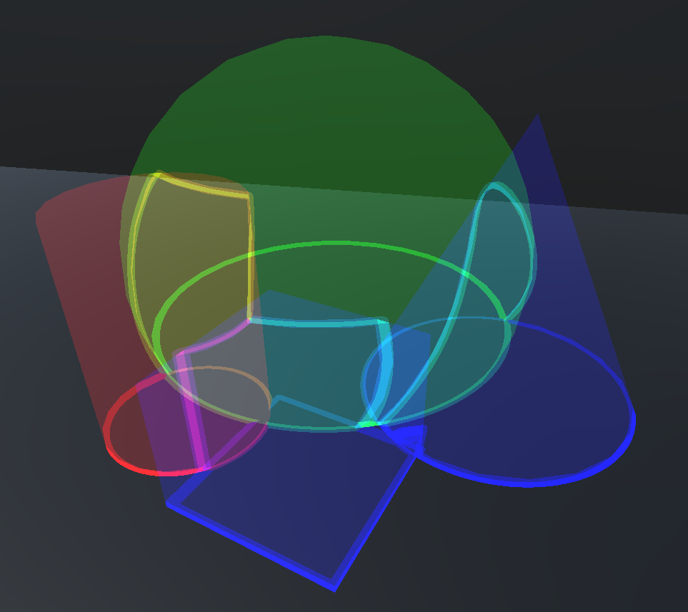

Light Volume Test
=================

This is a Unity project demonstrating how to draw additive light volumes with outlines where they intersect other geometry and each other.

Notes
-------

 - The light volumes are additive, so no sorting or depth challenges
 - Each volume is a primitive with an analytical signed distance field representation used by other volumes to draw intersection boundaries
 - The scene depth buffer is used to approximate intersection boundaries with other solid geometry
 - Backface culling is disabled, and the shader compensates for the viewpoint being inside a volume by rendering its far side twice as brightly
 - Depth testing is disabled, and the parts of the volume mesh that are behind solid geometry are either draw on top of the geometry or discarded
 - If the light volumes are going to be mostly static, one might save a tiny bit of perf by adjusting `SDFVolumeManagerComponent` to only update its GPU volume buffer when changes have occurred, rather than every frame

Usage
-----

1. Create a GameObject and add an `SDFVolumeManagerComponent`.
2. Add instances of the volume prefabs in `Prefabs/` as children of the manager you created, and transform them however you please.
3. Alternatively, you can create volumes without their respective GameObjects from script by using the `SDFVolumeManagerComponent.Add...(...)` methods.

